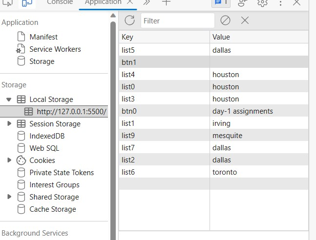
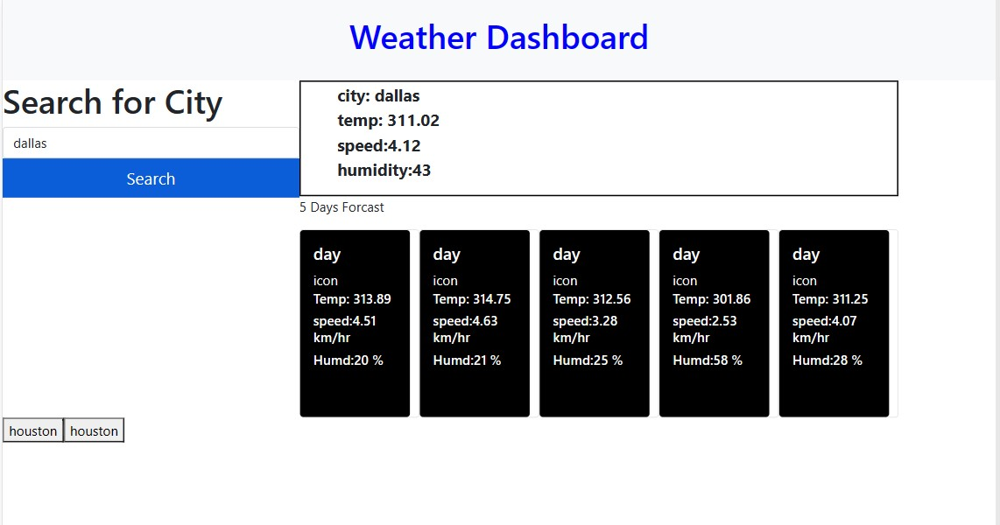

# weather1

<Bisrat Mengesha>

clone git@github.com:Hellobisrat/weather1.git
github https://github.com/Hellobisrat/weather1

i use bootstrap css
use also third party api 
and get whether based on the city given from user

saved the city name and stored in local storage

retrive the data from local storage and append to the bottom

image is link 

